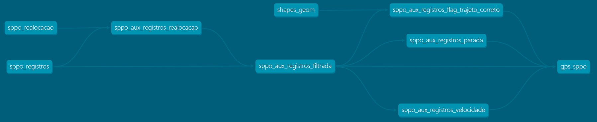
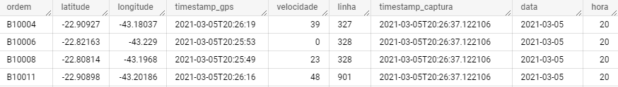
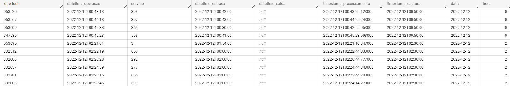

# Tratamento de Registros de GPS SPPO

* Versão: 1.0.0
* Data de início: 18/10/2022



## Introdução

A Secretaria Municipal de Transportes (SMTR) da Prefeitura da Cidade do Rio de Janeiro recebe das empresas operadoras os dados brutos do GPS embarcado em cada um dos veículos operantes no Sistema de Transporte Público por Ônibus (SPPO). Esses dados são transmitidos pelas empresas operadoras a cada 30s, capturados pela SMTR a cada 60s e são armazenados como dado bruto e dado tratado. 

Cada transmissão é representada geograficamente através de um ponto com latitude e longitude ([EPSG:4978 - WGS 84](https://epsg.io/4978)) e informações complementares, como número de ordem do veículo e a linha associada. Através dessa rotina, a cada minuto, os dados já capturados e armazenados são visualizados através da tabela [`sppo_registros`](https://www.data.rio/documents/transporte-rodoviário-gps-dos-ônibus).

Tabela `sppo_registros`


Eventualmente há erros na associação entre o veículo e a linha informada através do GPS. Dessa forma, as empresas operadoras podem informar uma realocação. A realocação é uma retificação, pela empresa operadora, da associação de linha a veículo e apenas pode ser realizada no limite máximo de 60 (sessenta) minutos conforme art. 2º, § 3º da Resolução SMTR Nº 3552/2022 ou legislação superveniente.

Nesse sentido, os dados de realocação são capturados a cada 10 minutos e são armazenados como dado bruto e dado tratado. Através dessa rotina, os dados já capturados e armazenados são visualizados através da tabela `sppo_realocacao`.

Tabela `sppo_realocacao`


Na sequência, será descrita a rotina de materialização dos registros de GPS, que ocorre no minuto 6 de cada hora.

## Etapas

### 1. Filtragem e tratamento básico de registros de realocação

Esta primeira etapa ([`sppo_aux_registros_realocacao`](https://github.com/prefeitura-rio/queries-rj-smtr/blob/master/models/br_rj_riodejaneiro_onibus_gps/sppo_aux_registros_realocacao.sql)) visa fazer o tratamento básico e filtragem dos dados de realocação através das subetapas descritas a seguir.

1. Filtra realocações válidas dentro do intervalo de GPS avaliado (máximo de 60 minutos);
2. Filtra apenas a realocação mais recente, caso existe mais de uma realocação para o mesmo período.

### 2. Filtragem e tratamento básico de registros de GPS

Esta etapa ([`sppo_aux_registros_filtrada`](https://github.com/prefeitura-rio/queries-rj-smtr/blob/master/models/br_rj_riodejaneiro_onibus_gps/sppo_aux_registros_filtrada.sql)) visa fazer o tratamento básico e filtragem desses dados através das subetapas descritas a seguir.

1. Seleciona apenas registros que estão no interior de uma caixa que contém a área do município de Rio de Janeiro;
2. Filtra apenas os registros do último minuto (remove registros que tem diferença maior que 1 minuto entre o `timestamp_captura` e `timestamp_gps`);
3. Muda o nome de variáveis para o padrão do projeto (`id_veiculo > ordem`, por exemplo).

**Observações:**
* A opção pela caixa, a despeito de um polígono com os limites municipais, se deu em razão de linhas com itinerário próximo a esses limites. Nesse caso, o GPS poderia indicar um ponto um pouco fora do limite, que seria perdido.

### 3. Verificação de descumprimento de itinerário

Nesta etapa ([`sppo_aux_registros_flag_trajeto_correto`](https://github.com/prefeitura-rio/queries-rj-smtr/blob/master/models/br_rj_riodejaneiro_onibus_gps/sppo_aux_registros_flag_trajeto_correto.sql)) é verificado se o veículo está dentro do trajeto correto dado o traçado (shape) em relação à linha associada na transmissão. O itinerário é cadastrado na aplicação da SMTR de gerenciamento de mobilidade urbana do município do Rio de Janeiro (SIGMOB). São observadas as seguintes subetapas:

1. Verifica se os pontos transmitidos pelo GPS encontram-se dentro de um _buffer_ de `tamanho_buffer_metros` em relação ao traçado definido no SIGMOB. Caso o ponto esteja no interior do _buffer_, atribui-se **verdadeiro** ao parâmetro `flag_trajeto_correto`. Caso contrário, é atribuído **falso**;
2. Calcula um histórico do parâmetro `flag_trajeto_correto` nos últimos 10 minutos de registros de cada veículo;
3. Identifica se a linha informada no registro capturado existe nas definições presentes no SIGMOB;
4. Verifica a `data_versao` de shape na tabela `shapes_geom`; 
5. Agregação com `LOGICAL_OR` para evitar duplicação de registros.

**Observações:**
* Definiu-se que o veículo é considerado fora do trajeto definido se a cada 10 minutos, ele não esteve dentro do traçado planejado pelo menos uma vez;
* Definiu-se na tabela `shapes_geom` a coluna `data_versao` para identificar qual versão do shape no SIGMOB será utilizada;
* Como não é possível identificar o itinerário que o veículo está realizando no passo 2, os resultados de intersecções são dobrados, devido ao fato de cada linha apresentar dois itinerários possíveis (ida/volta). Portanto, ao final, é necessário realizar uma agregação `LOGICAL_OR` ao qual atribui-se **verdadeiro** caso o veículo esteja dentro do traçado de algum dos itinerários possíveis para a linha associada.

**Variáveis:**
```
tamanho_buffer_metros: 500
``` 

### 4. Identificação de veículos parados em terminais ou garagens conhecidas

Nesta etapa ([`sppo_aux_registros_parada`](https://github.com/prefeitura-rio/queries-rj-smtr/blob/master/models/br_rj_riodejaneiro_onibus_gps/sppo_aux_registros_parada.sql)) é verificado se o veículo está parado em terminais ou garagens conhecidas. São observadas as seguintes subetapas:

1. Selecionam-se os terminais, criando uma geometria do tipo ponto para cada;
2. Selecionam-se os polígonos das garagens;
2. Calcula-se as distâncias dos veículos em relação aos terminais conhecidos, selecionando apenas a menor distância em relação à posição do veículo; 
3. Caso o veículo esteja a uma distância menor que `distancia_limiar_parada` de um terminal, será considerado como parado no terminal com menor distância.
4. Caso o veiculo esteja no interior do polígono de uma das garagens, ele será considerado como parado dentro de uma garagem.

**Variáveis:**
```
distancia_limiar_parada: 250
``` 

### 5. Identificação de _status_ de movimentação do veículo

Nesta etapa ([`sppo_aux_registros_velocidade`](https://github.com/prefeitura-rio/queries-rj-smtr/blob/master/models/br_rj_riodejaneiro_onibus_gps/sppo_aux_registros_velocidade.sql)) é verificado o _status_ de movimentação do veículo (parado ou em movimento). Isso é realizado através da estimativa das velocidades do veículo nos últimos 10 minutos contados a partir da `timestamp_gps` atual. São observadas as seguintes subetapas:

1. Considera-se a mínima distância cartesiana entre o ponto mais antigo e do ponto atual nos últimos 10 minutos de operação;
2. Divide-se essa distância pela diferença de tempo entre a `timestamp_gps` atual e a `timestamp_gps` do ponto mais antigo da janela em segundos;
3. Multiplica-se o resultado da divisão pelo fator `3.6` para converter de m/s para km/h. O resultado final é arrendondado sem casas decimais.
4. Após o calculo da velocidade, define-se a coluna `status_movimento`. Veículos abaixo da `velocidade_limiar_parado`, são considerados como `parado`. Caso contrário, são considerados `andando`.
 
**Variáveis:**
```
velocidade_limiar_parado: 3
``` 
