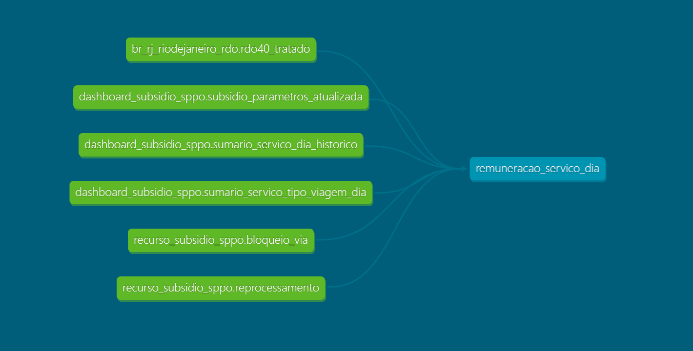

# Modelo do Encontro de Contas 
* Versão: 0.1
* Data de início: 17/08/2023
* Autor: Igor Laltuf

## Descrição
Este repositório contém o modelo com os dados do encontro de contas por serviço-dia para o período entre 01/06/2022 e 31/05/2023.

## Sobre os dados

### 1 - Tabela 

As tabelas utilizadas para consolidar os dados do encontro de contas podem ser vistas no esquema abaixo:

 

 

### 2 - Validação
 
Os totais por coluna foram validados com base nos dados do notebook utilizado para consolidação dos dados do encontro de contas.

 
 

### 3 - Glossário
 
Serviços-dia: é a menor unidade de medida dos dados das tabelas deste repositório. Isto quer dizer que cada linha contém os valores para determinada linha de ônibus (serviço) em determinado dia.
 
 
IRK: Índice de Remuneração por Quilômetro calculado pela equipe de planejamento com base na Tarifa de Remuneração.
 
 
IRK Tarifa Pública: Índice de Remuneração por Quilômetro calculado com base na tarifa pública.
 
 
Receita Esperada: é o resultante da multiplicação do IRK pela quantidade de quilômetros apurados.
 
 
Receita Apurada: calculada por meio da soma entre o valor da remuneração tarifária e do subsídio.
 
 
Quilometragem: Quilometragem apurada por serviço-dia.
 
 
Desconto Subsídio: Valor descontado do subsídio (ex: veículo sem ar e não autuado, autuado por ar, segurança etc).
 
 
Receita Esperada: IRK x Quilometragem.
 
 
Subsídio Esperado: (IRK - IRK_tarifa_pública) x Quilometragem.
 
 
Receita Tarifária Esperada: IRK_tarifa_pública x Quilometragem.
 
 
Receita Tarifária: Valor da receita extraído do RDO e proveniente exclusivamente da tarifa pública por serviço-dia.
 
 
Subsídio: Valor do subsídio que foi pago por serviço-dia.
 
 
Receita Aferida: Remuneração Tarifária + Subsídio.
 
 
Diferença entre tarifário e esperado: Receita Tarifaria - (Receita Esperada - Desconto Subsídio).
 
 
Diferença entre aferido e esperado: Receita Aferida - (Receita Esperada - Desconto Subsídio).
