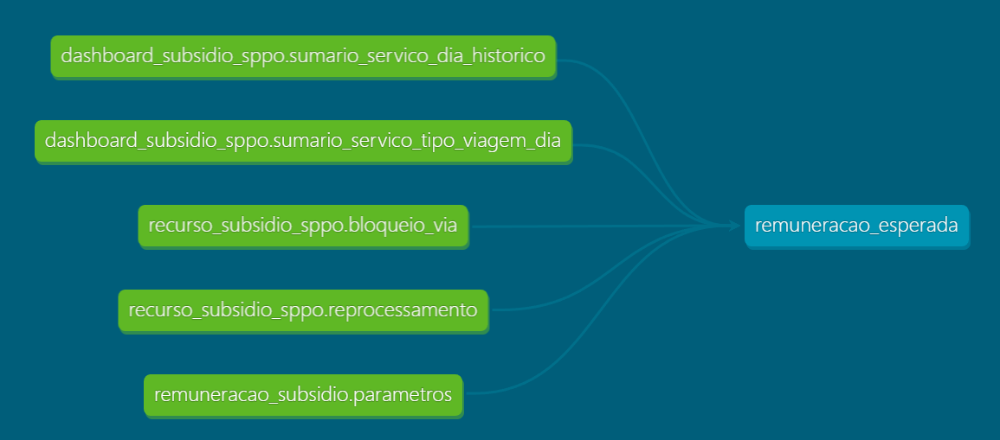
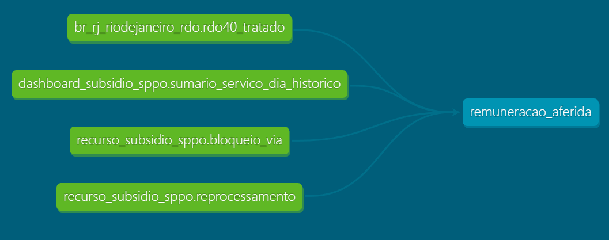

# Remuneração do Subsídio
* Versão: 0.1
* Data de início: 17/07/2023
* Autor: Igor Laltuf

## Descrição
Este repositório contém a documentação dos cálculos de remuneração aferida e esperada do subsídio por serviços-dia.

## Sobre os dados

### 1 - Tabela remuneracao_esperada
 

 

### 2 - Tabela remuneracao_aferida
 

 

### 3 - Glossário
 
Serviços-dia: é a menor unidade de medida dos dados das tabelas deste repositório. Isto quer dizer que cada linha contém os valores para determinada linha de ônibus (serviço) em determinado dia.
 
 
IRK: Índice de Remuneração por Quilômetro, calculado pela equipe de planejamento com base nos dados do RDO.
 
 
Receita Esperada: é o resultante da multiplicação do IRK pela quantidade de quilômetros apurados.
 
 
Receita Apurada: calculada por meio da soma entre o valor da remuneração tarifária e do subsídio.
 
 